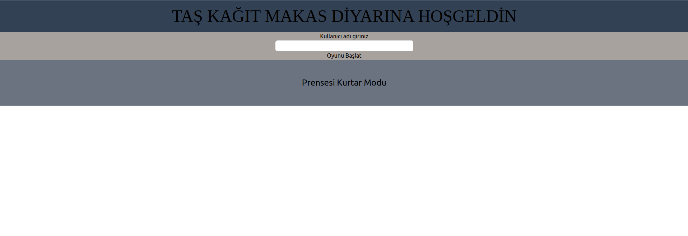
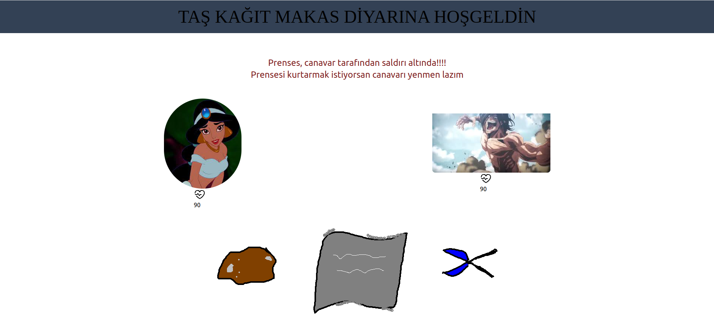
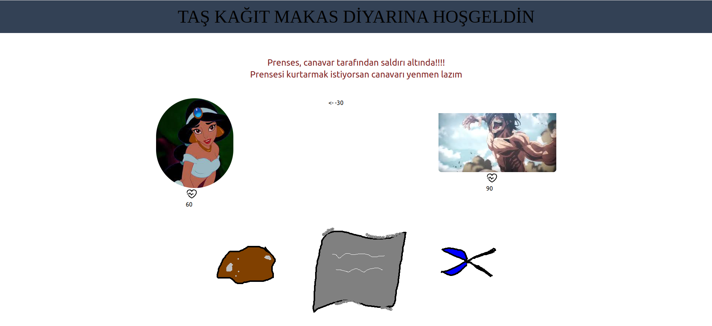
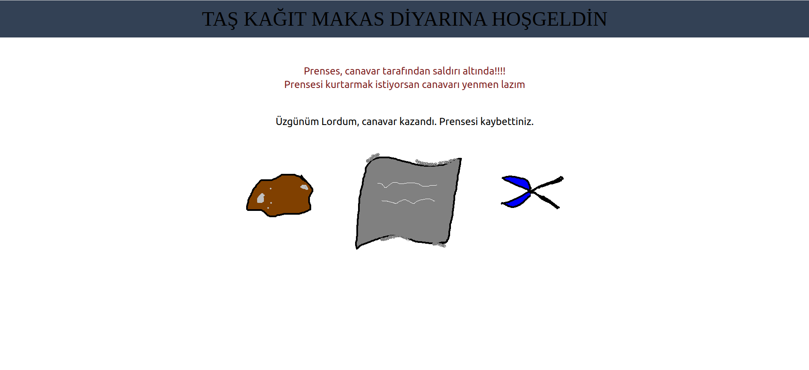

### Taş, Kağıt, Makas Oyunu
# Oyunda yapılan tercih sonucu round'un kazanılması durumunda karşı oyuncuya hasar verilir. Oyundaki oyuncuların canının bitmesi durumunda oyun sonlanır ve kazanan belirlenir. Oynayan oyuncuların kazanma sayıları, oyuna başlarken girdikleri isimleri tutulur ve skor tablosunda gösterilir. 
-----

Projede front-end teknolojisi olarak React, oyuncuların bilgilerini saklamak için Nodejs Back-end teknolojilerini kullandım.  Veritabanı olarak Postgresql uygulamasını kullandım. Ayrıca veritabanını docker ile ayağa kaldırdım.  

## Oyun İçi Görüntüler

